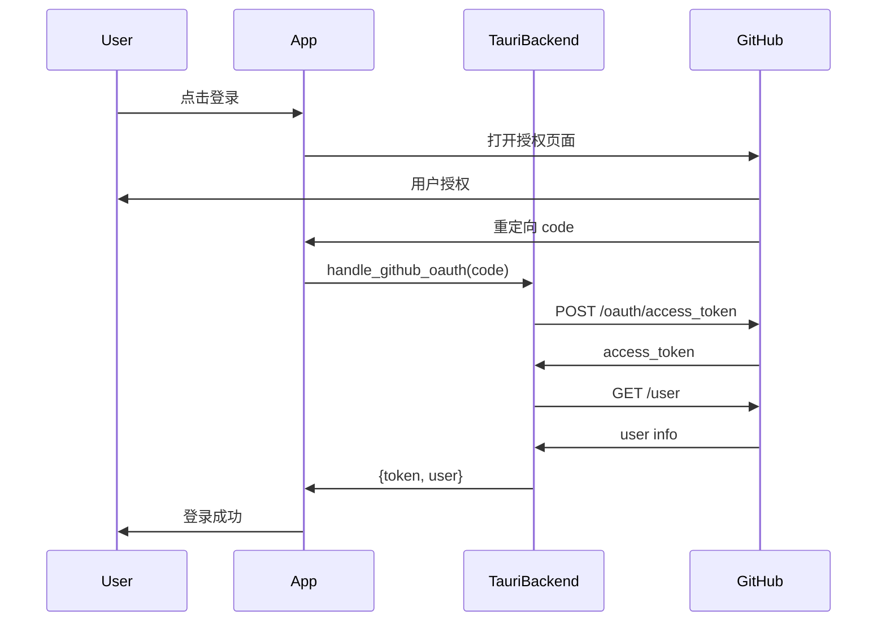

# GitHub OAuth 完整实现指南

本文档说明如何在 iFocus 中实现完整的 GitHub OAuth 认证流程（通过 Tauri 后端处理 Client Secret）。

## 架构说明

```
┌─────────────┐      ┌──────────────┐      ┌─────────────┐
│   前端 UI   │─────▶│ Tauri 后端   │─────▶│  GitHub API │
│  (React)    │      │   (Rust)     │      │             │
└─────────────┘      └──────────────┘      └─────────────┘
     ▲                      │
     │                      │
     └──────────────────────┘
        返回 token + user
```

**优势**：Client Secret 安全存储在应用本地，不会暴露给前端或网络传输。

## 实现步骤

### 1. 创建 GitHub OAuth App

1. 访问 [GitHub Developer Settings](https://github.com/settings/developers)
2. 点击 "New OAuth App"
3. 填写信息：
   - **Application name**: `iFocus`
   - **Homepage URL**: `https://github.com/yourusername/ifocus`（或你的项目地址）
   - **Authorization callback URL**: `ifocus://auth/callback`
   - **Description**: 可选，描述应用用途

4. 创建后获取：
   - **Client ID**: 例如 `Ov23liZpDAtVMTavdA3s`（已配置）
   - **Client Secret**: 点击 "Generate a new client secret" 生成

### 2. 配置环境变量

在项目根目录创建 `.env` 文件（不要提交到 Git）：

```bash
# 复制示例文件
cp .env.example .env
```

编辑 `.env` 文件，填入 Client Secret：

```env
GITHUB_CLIENT_SECRET=your_actual_client_secret_here
```

### 3. 后端实现（已完成）

已创建以下文件和功能：

#### `src-tauri/src/github_oauth.rs`
- `exchange_code_for_token()`: 用 code 交换 access token
- `get_user_info()`: 获取用户信息
- `handle_oauth_callback()`: 完整 OAuth 流程处理

#### `src-tauri/src/main.rs`
- 添加 `handle_github_oauth` Tauri 命令
- 加载 `.env` 环境变量

#### `src-tauri/Cargo.toml`
- 添加依赖：`reqwest`, `tokio`, `dotenv`

### 4. 前端实现（已完成）

#### `src/services/githubSync.ts`
- 更新 `handleOAuthCallback()` 调用 Tauri 后端命令
- 保持 `authenticateWithToken()` 作为备用方案

### 5. OAuth 认证流程



### 6. 实现 OAuth 回调监听（✅ 已完成）

已在应用中实现自定义协议监听器：

#### ✅ 单实例 + Deep-Link 集成

**重要**：Windows/Linux/macOS 上必须使用单实例插件来正确处理 deep-link 回调！

**src-tauri/Cargo.toml**
```toml
# 仅桌面平台（排除 Android/iOS）
[target.'cfg(not(any(target_os = "android", target_os = "ios")))'.dependencies]
tauri-plugin-single-instance = { version = "2", features = ["deep-link"] }
```

**src-tauri/src/main.rs**
```rust
#[cfg(desktop)]
{
    builder = builder.plugin(tauri_plugin_single_instance::init(|app, argv, cwd| {
        println!("检测到新实例启动，参数: {:?}", argv);
        // deep-link 插件会自动处理 argv 中的 URL
        if let Some(window) = app.get_webview_window("main") {
            let _ = window.show();
            let _ = window.set_focus();
        }
    }));
}
```

#### ✅ 配置文件 `src-tauri/tauri.conf.json`

```json
{
  "plugins": {
    "deep-link": {
      "desktop": {
        "schemes": ["ifocus"]
      }
    }
  }
}
```

#### ✅ 前端监听回调 `src/hooks/useGitHubSync.ts`

```typescript
import { onOpenUrl } from '@tauri-apps/plugin-deep-link';

useEffect(() => {
  const setupDeepLink = async () => {
    const unlisten = await onOpenUrl((urls) => {
      for (const url of urls) {
        if (url.startsWith('ifocus://auth/callback')) {
          const urlObj = new URL(url.replace('ifocus://', 'http://'));
          const code = urlObj.searchParams.get('code');
          if (code) {
            handleOAuthCallback(code)
              .then(({ user }) => {
                setUser(user);
                // 显示登录成功通知
              })
              .catch((error) => {
                console.error('OAuth 失败:', error);
              });
          }
        }
      }
    });
  };
  
  setupDeepLink();
}, []);
```

**流程说明**：
1. 用户点击登录 → 浏览器打开 GitHub 授权页
2. 用户授权 → GitHub 重定向到 `ifocus://auth/callback?code=xxx`
3. 操作系统将 URL 传递给应用
4. 应用监听到 URL，提取 code
5. 调用 Tauri 后端 `handle_github_oauth`
6. 后端安全地与 GitHub 交换 token
7. 返回 token 和用户信息到前端
8. 显示登录成功

**✅ 已修复的问题**：

1. **Deep-link 监听器已正确实现**
   - 后端使用 `DeepLinkExt::on_open_url()` 监听事件
   - Windows/Linux 开发模式下自动注册所有 schemes
   - 添加了详细的日志输出

2. **前端调试日志已增强**
   - 在 `handleOAuthCallback` 中添加了详细的步骤日志
   - 在 `processOAuthCallback` 中添加了 URL 解析日志
   - 使用 emoji 前缀使日志更易于识别

3. **错误处理已改进**
   - 捕获并记录所有可能的错误点
   - 提供有用的错误消息
   - 显示部分 code 用于调试（不完整暴露）

### 7. 安装依赖

```bash
# 前端依赖（如需 deep-link 插件）
pnpm add @tauri-apps/plugin-deep-link

# Rust 依赖会自动安装
cd src-tauri
cargo build
```

### 8. 测试流程

#### 开发环境测试

```bash
# 1. 确保 .env 文件已配置
cat .env  # 检查 GITHUB_CLIENT_SECRET

# 2. 启动开发服务器
pnpm tauri:dev

# 3. 在应用中点击 "使用 GitHub 登录"
# 4. 浏览器会打开 GitHub 授权页面
# 5. 授权后会重定向回应用
```

#### 手动测试后端命令

在 Tauri DevTools 控制台：

```javascript
// 假设你已经有一个授权 code
const code = 'your_test_code_here';
await window.__TAURI__.core.invoke('handle_github_oauth', { code });
```

### 9. 生产环境部署

#### 方案 A：使用环境变量（推荐）

在构建时注入：

```bash
# Windows
set GITHUB_CLIENT_SECRET=your_secret && pnpm tauri:build

# Linux/macOS
GITHUB_CLIENT_SECRET=your_secret pnpm tauri:build
```

#### 方案 B：使用配置文件

在应用数据目录存储加密配置：

```rust
use tauri::api::path::app_config_dir;

fn get_client_secret(app: &tauri::AppHandle) -> Result<String, String> {
    let config_dir = app_config_dir(&app.config()).unwrap();
    let secret_file = config_dir.join("github_secret.enc");
    // 读取并解密 secret
    // ...
}
```

### 10. 安全建议

1. **不要硬编码 Secret**：始终使用环境变量或加密配置
2. **限制权限范围**：OAuth 只请求必要的 `gist` 权限
3. **Token 加密存储**：考虑使用系统密钥链存储 token
4. **定期轮换 Secret**：定期更新 GitHub OAuth App 的 Client Secret
5. **日志脱敏**：确保 secret 不会出现在日志中

### 11. 使用说明

配置完成后，用户使用非常简单：

1. 点击 "使用 GitHub 登录" 按钮
2. 在打开的浏览器中授权应用
3. 自动返回应用完成登录
4. 开始使用云端同步功能

无需手动创建或输入任何 token，全部自动化处理。

## 常见问题

### Q: 为什么不使用纯前端 OAuth？
A: GitHub OAuth 需要 Client Secret，暴露在前端不安全。通过 Tauri 后端处理可以安全存储 Secret。

### Q: Client Secret 存在哪里？
A: 开发时在 `.env` 文件，生产时可以在环境变量或加密配置文件中。

### Q: 如何处理 Token 过期？
A: GitHub PAT 可以设置永不过期，或在过期时提示用户重新登录。

### Q: 多设备如何同步？
A: 每个设备独立登录，数据通过 GitHub Gist 同步，token 存储在本地。

## 相关资源

- [GitHub OAuth 文档](https://docs.github.com/en/apps/oauth-apps/building-oauth-apps)
- [Tauri Deep Link 插件](https://tauri.app/plugin/deep-link/)
- [Tauri 自定义协议](https://tauri.app/develop/calling-rust/#custom-protocols)

